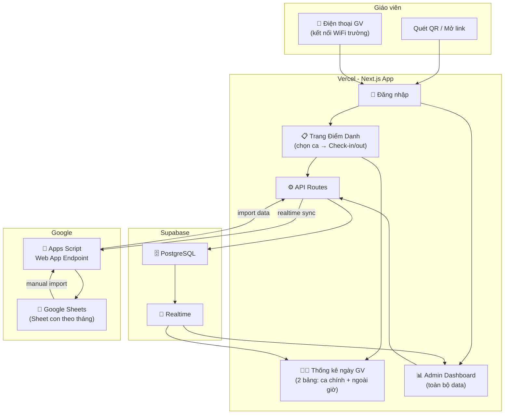
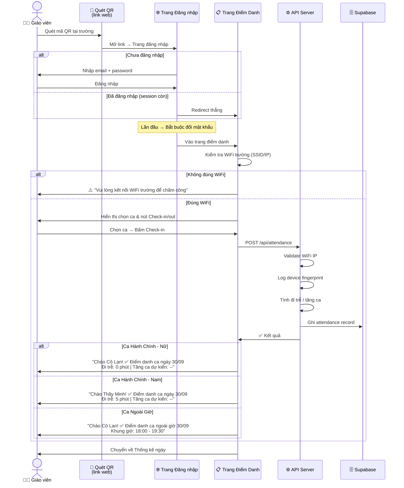
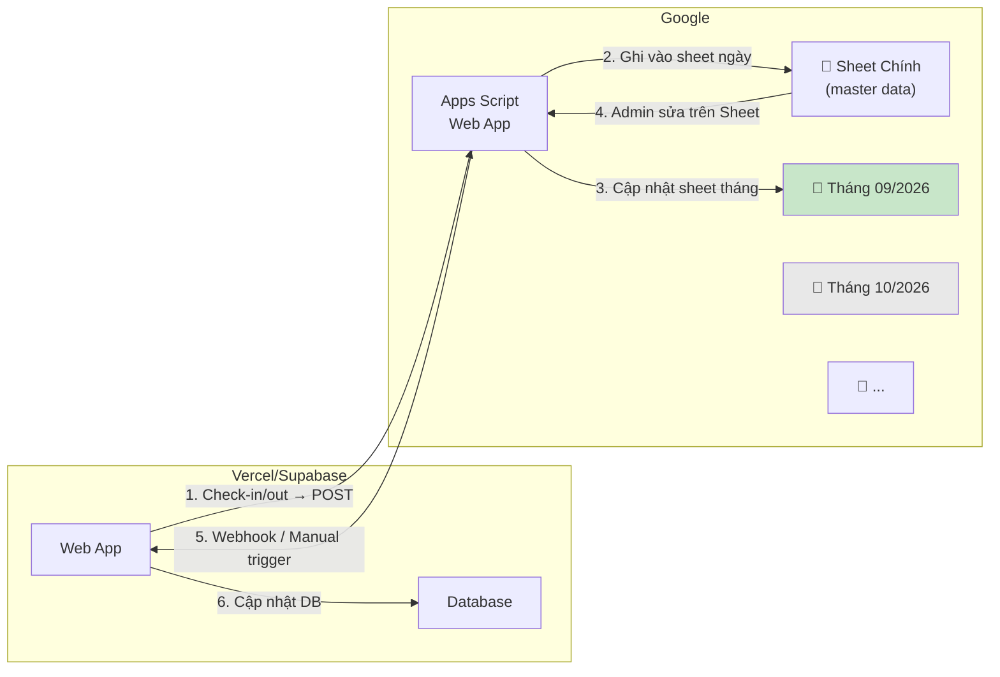
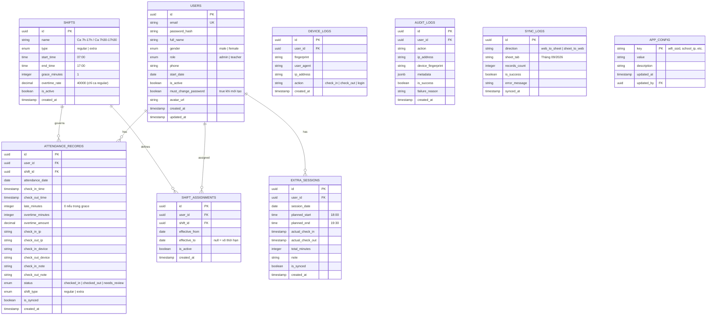

# 🏫 Lumi Preschool - Hệ thống Chấm Công Giáo Viên (v2)

## Tài liệu tham khảo từ hệ thống cũ

````carousel

<!-- slide -->

<!-- slide -->

````

---

## Thay đổi so với v1

> [!IMPORTANT]
> **6 thay đổi lớn** dựa trên phản hồi của anh:
> 1. **QR chỉ là URL** → không xoay vòng, chỉ là link vào trang điểm danh
> 2. **Giáo viên phải đăng nhập** → mới điểm danh được (chống gian lận bằng account + WiFi)
> 3. **Ca CRUD linh hoạt** → VD: Cô A ca 7:00-17:00, Cô B ca 7:30-17:30, tăng ca tính sau giờ kết thúc ca của mỗi người
> 4. **Không cần cấu hình lịch tuần** → hệ thống luôn mở, có check-in ngày nào = làm ngày đó
> 5. **Giáo viên chỉ xem 2 bảng thống kê trong ngày** (ca chính + ca ngoài giờ), reset hàng ngày
> 6. **Google Sheets = nguồn báo cáo chính** → Sheet con theo tháng, dùng trực tiếp để làm bảng lương Excel

---

## 1. Business Context (BMAD)

| Yếu tố | Chi tiết |
|---------|----------|
| **Tổ chức** | Trường mầm non Lumi Preschool |
| **Quy mô** | 20 user hiện tại, tối đa 50 user |
| **Vai trò** | Admin (= Giám đốc, đồng quyền), Giáo viên |
| **Hệ thống hiện tại** | Google Sheets + AppScript (2handland.com) |
| **Pain points** | Gian lận chấm công hộ, thiếu tự động tính trễ/tăng ca, ca ngoài giờ không linh hoạt |

## 2. Mission

> Xây dựng hệ thống chấm công web, chống gian lận qua WiFi + device log, tự động tính trễ/tăng ca theo ca linh hoạt, đồng bộ realtime 2 chiều với Google Sheets, và hiển thị thống kê trong ngày cho giáo viên.

---

## 3. Architecture



---

## 4. Nghiệp vụ Chi tiết

### 4.1 Ca Hành Chính (CRUD — linh hoạt theo giáo viên)

| Thuộc tính | Giá trị | Ghi chú |
|------------|---------|---------|
| **Giờ mặc định** | 07:00 → 17:00 (10 tiếng) | Có thể CRUD ca khác |
| **Ví dụ ca khác** | 07:30 → 17:30 (10 tiếng) | Cô A bắt đầu muộn → kết thúc muộn |
| **Grace period** | **1 phút** | 07:01 = đúng giờ, 07:02 = trễ 2 phút |
| **Tăng ca** | Cộng dồn ngay sau giờ kết thúc ca | 40,000 VNĐ/giờ, cố định |
| **Ngày làm** | Luôn mở — có check-in ngày nào = làm ngày đó | Không cần cấu hình trước |
| **Ngày lễ** | Nghỉ (không check-in) | Không có rate khác |
| **Quên check-out** | Để trống, Admin chỉnh thủ công | Hoặc auto ghi 17:00, đánh dấu "cần xác nhận" |

**Logic tính toán (cho ca bất kỳ):**
```
shift_start = ca.start_time    // VD: 07:00 hoặc 07:30
shift_end   = ca.end_time      // VD: 17:00 hoặc 17:30
grace       = 1 phút

// Đi trễ
if check_in_time <= shift_start + grace:
    đi_trễ = 0
else:
    đi_trễ = check_in_time - shift_start (phút)

// Tăng ca (cộng dồn ngay sau giờ kết thúc ca)
if check_out_time > shift_end:
    tăng_ca = check_out_time - shift_end (phút)
else:
    tăng_ca = 0

tiền_tăng_ca = (tăng_ca / 60) × 40,000 VNĐ
```

### 4.2 Ca Ngoài Giờ (Dạy thêm — CRUD)

| Thuộc tính | Giá trị |
|------------|---------|
| **Tạo bởi** | Admin CRUD |
| **Khung giờ** | Linh hoạt: VD 18:00-19:30, 18:00-20:30 |
| **Thù lao** | Không có (chỉ ghi nhận khung giờ) |
| **Check-in/out** | Giáo viên chọn ca ngoài giờ → check-in/out |
| **1 GV có thể** | Làm cả ca chính + ca ngoài giờ trong 1 ngày |

### 4.3 Luồng Điểm Danh (Mới)



### 4.4 Trang Thống Kê Ngày (cho Giáo viên)

Sau khi check-in/out, giáo viên thấy **2 bảng thống kê realtime trong ngày**:

**Bảng 1 — Ca Hành Chính (30/09/2026):**

| # | Giáo viên | Check-in | Check-out | Trễ (phút) | Tăng ca (phút) | Ghi chú |
|---|-----------|----------|-----------|------------|-----------------|---------|
| 1 | Cô Lan | 06:58 | — | 0 | — | |
| 2 | Thầy Minh | 07:05 | — | 5 | — | |
| 3 | Cô Hoa | 07:30 | — | 0 | — | Ca 7:30-17:30 |
| ... | | | | | | |

**Bảng 2 — Ca Ngoài Giờ (30/09/2026):**

| # | Giáo viên | Ca | Check-in | Check-out | Ghi chú |
|---|-----------|-----|----------|-----------|---------|
| 1 | Cô Lan | 18:00-19:30 | 17:58 | — | |
| 2 | Cô Thu | 18:00-20:30 | 18:02 | — | |

> [!NOTE]
> - Bảng này **tất cả giáo viên đều xem được** → để "ý kiến" trong ngày
> - **Reset tự động** qua ngày mới
> - Chỉ hiển thị thông tin **ngày hôm nay** — giáo viên KHÔNG xem được lịch sử
> - Chỉ **Admin** mới xem được toàn bộ dữ liệu (tất cả ngày, báo cáo, chỉnh sửa)

### 4.5 Giao diện Giáo viên (đơn giản)

```
┌─────────────────────────────────────┐
│  🏫 Lumi Preschool                  │
│  Chào Cô Lan! 👋                    │
├─────────────────────────────────────┤
│                                     │
│  📋 ĐIỂM DANH                       │
│  [Chọn ca: ▼ Ca 7:00-17:00]        │
│  [ 🟢 CHECK-IN ]  [ 🔴 CHECK-OUT ] │
│                                     │
│  ✅ Đã check-in lúc 06:58           │
│  Đi trễ: 0 phút                    │
│                                     │
├─────────────────────────────────────┤
│                                     │
│  📊 THỐNG KÊ CA CHÍNH HÔM NAY      │
│  ┌──┬────────┬───────┬──────┬─────┐ │
│  │# │Giáo viên│IN     │OUT   │Trễ  │ │
│  ├──┼────────┼───────┼──────┼─────┤ │
│  │1 │Cô Lan  │06:58  │—     │0    │ │
│  │2 │Thầy Minh│07:05 │—     │5    │ │
│  └──┴────────┴───────┴──────┴─────┘ │
│                                     │
│  📊 THỐNG KÊ CA NGOÀI GIỜ HÔM NAY  │
│  ┌──┬────────┬───────┬──────┬─────┐ │
│  │# │Giáo viên│Ca    │IN    │OUT  │ │
│  └──┴────────┴───────┴──────┴─────┘ │
│                                     │
├─────────────────────────────────────┤
│  📖 HƯỚNG DẪN SỬ DỤNG              │
│  1. Kết nối WiFi trường             │
│  2. Chọn ca → Bấm Check-in         │
│  3. Cuối ca → Bấm Check-out        │
│                                     │
│  ℹ️ THÔNG TIN CHUNG                 │
│  • Ca HC: 7:00-17:00                │
│  • Tăng ca: 40,000đ/giờ            │
│  • Grace period: 1 phút             │
└─────────────────────────────────────┘
```

### 4.6 Chống Gian Lận (Đã điều chỉnh)

| Lớp | Phương pháp | Hành vi |
|-----|-------------|---------|
| **L1** | **Đăng nhập bắt buộc** | Mỗi GV dùng tài khoản riêng → không check-in hộ được |
| **L2** | **WiFi Check** | Kiểm tra IP/SSID mạng WiFi trường. Nếu sai → **block check-in**, hiện thông báo |
| **L3** | **Device Logging** | Ghi nhận fingerprint thiết bị mỗi lần check-in. **Không block** — chỉ ghi log để admin review nếu có nghi vấn |
| **L4** | **Geo-fencing** (fallback) | Nếu WiFi check fail → kiểm tra GPS ~200m quanh trường |
| **L5** | **Audit Log** | Mọi attempt (thành công/thất bại) ghi đầy đủ: IP, device, thời gian, kết quả |

> [!NOTE]
> **Không dùng QR xoay vòng** — vì QR chỉ là link web. Chống gian lận chính bằng **Account + WiFi + Device log**.

### 4.7 Google Sheets Sync (2 chiều, Realtime)



**Cấu trúc Google Sheets:**

| Sheet Tab | Nội dung |
|-----------|----------|
| **Master** | Danh sách giáo viên, cấu hình ca |
| **Tháng 09/2026** | Bảng chấm công tháng 9: mỗi hàng = 1 GV, mỗi cột = 1 ngày, giá trị = IN/OUT/trễ/tăng ca |
| **Tháng 10/2026** | Tương tự |
| **Tổng hợp** | Tổng ngày làm, tổng phút trễ, tổng phút tăng ca, tổng tiền tăng ca, tổng giờ ngoài giờ — cho từng GV |

> [!IMPORTANT]
> Google Sheets là **nguồn báo cáo chính** để làm bảng lương (Excel). Web admin chỉ để xem trực quan.

---

## 5. Data Model (Đã cập nhật)



> [!NOTE]
> **Thay đổi so với v1:**
> - Bỏ `WEEKLY_SCHEDULE` — không cần cấu hình lịch tuần
> - Bỏ `QR_TOKENS` — QR chỉ là URL, không xoay vòng
> - Bỏ `DEVICES` (whitelist) → đổi thành `DEVICE_LOGS` (chỉ ghi log, không block)
> - Thêm `SHIFT_ASSIGNMENTS` — gán ca cho từng giáo viên
> - Thêm `APP_CONFIG` — cấu hình linh hoạt (WiFi SSID, IP trường, etc.)
> - `USERS.must_change_password` — bắt đổi MK lần đầu
> - `USERS.role` chỉ còn 2: `admin` | `teacher` (giám đốc = admin)

---

## 6. Tech Stack

| Layer | Technology | Ghi chú |
|-------|-----------|---------|
| **Framework** | Next.js 14 (App Router) | SSR, tối ưu Vercel |
| **UI** | Tailwind CSS + shadcn/ui | Đẹp, components sẵn |
| **Auth** | NextAuth.js v5 (Credentials) | Email/Password |
| **Database** | Supabase PostgreSQL + Realtime | Free tier đủ cho 50 user |
| **Hosting** | Vercel Free | CI/CD tự động |
| **Sync** | Google Apps Script Web App | POST endpoint 2 chiều |
| **Charts** | Recharts | Biểu đồ admin |
| **Fingerprint** | FingerprintJS (free) | Device logging |

**Chi phí: \$0/tháng** (tất cả free tier)

---

## 7. Project Structure

```
ChamCongLumi/
├── public/
│   ├── logolumi.jpg
│   └── favicon.ico
├── src/
│   ├── app/
│   │   ├── layout.tsx                    # Root layout
│   │   ├── page.tsx                      # Redirect → /login hoặc /teacher
│   │   │
│   │   ├── (auth)/
│   │   │   ├── login/page.tsx            # Đăng nhập
│   │   │   └── change-password/page.tsx  # Đổi MK lần đầu
│   │   │
│   │   ├── (teacher)/                    # 🟢 Giao diện giáo viên
│   │   │   ├── layout.tsx                # Layout đơn giản (logo, chào)
│   │   │   ├── teacher/page.tsx          # Trang chính GV
│   │   │   │                             #   - Chào Cô/Thầy + Nút Điểm danh
│   │   │   │                             #   - Bảng TK ca chính hôm nay (realtime)
│   │   │   │                             #   - Bảng TK ca ngoài giờ hôm nay (realtime)
│   │   │   │                             #   - Hướng dẫn sử dụng
│   │   │   │                             #   - Thông tin chung
│   │   │   └── checkin/page.tsx          # Trang điểm danh (chọn ca → IN/OUT)
│   │   │
│   │   ├── (admin)/                      # 🔴 Dashboard Admin
│   │   │   ├── layout.tsx                # Layout sidebar
│   │   │   ├── admin/page.tsx            # Overview
│   │   │   ├── admin/attendance/page.tsx # Bảng chấm công (tất cả ngày)
│   │   │   ├── admin/teachers/page.tsx   # CRUD giáo viên
│   │   │   ├── admin/shifts/page.tsx     # CRUD ca làm việc
│   │   │   ├── admin/extra/page.tsx      # CRUD ca ngoài giờ
│   │   │   ├── admin/reports/page.tsx    # Báo cáo trực quan
│   │   │   ├── admin/devices/page.tsx    # Xem device logs
│   │   │   ├── admin/sync/page.tsx       # Google Sheets sync
│   │   │   ├── admin/settings/page.tsx   # Cấu hình (WiFi, IP, etc.)
│   │   │   └── admin/audit/page.tsx      # Audit logs
│   │   │
│   │   └── api/
│   │       ├── auth/[...nextauth]/route.ts
│   │       ├── attendance/
│   │       │   ├── route.ts              # GET (list) + POST (check-in/out)
│   │       │   ├── [id]/route.ts         # PUT (admin edit) + DELETE
│   │       │   └── today/route.ts        # GET today's records
│   │       ├── teachers/
│   │       │   ├── route.ts              # GET + POST
│   │       │   └── [id]/route.ts         # PUT + DELETE
│   │       ├── shifts/
│   │       │   ├── route.ts              # GET + POST
│   │       │   ├── [id]/route.ts         # PUT + DELETE
│   │       │   └── assignments/route.ts  # Gán ca cho GV
│   │       ├── extra-sessions/
│   │       │   ├── route.ts
│   │       │   └── [id]/route.ts
│   │       ├── sync/
│   │       │   ├── to-sheets/route.ts    # Push → Google Sheets
│   │       │   └── from-sheets/route.ts  # Pull ← Google Sheets
│   │       ├── reports/
│   │       │   └── monthly/route.ts
│   │       └── config/route.ts           # App settings
│   │
│   ├── components/
│   │   ├── ui/                           # shadcn/ui
│   │   ├── layout/
│   │   │   ├── AdminSidebar.tsx
│   │   │   ├── TeacherHeader.tsx
│   │   │   └── Footer.tsx
│   │   ├── checkin/
│   │   │   ├── ShiftSelector.tsx         # Dropdown chọn ca
│   │   │   ├── CheckinButton.tsx         # Nút IN/OUT
│   │   │   ├── CheckinResult.tsx         # Hiện kết quả + trễ/tăng ca
│   │   │   └── WifiGuard.tsx             # Kiểm tra WiFi
│   │   ├── attendance/
│   │   │   ├── TodayRegularTable.tsx     # Bảng TK ca chính hôm nay
│   │   │   ├── TodayExtraTable.tsx       # Bảng TK ca ngoài giờ hôm nay
│   │   │   └── AdminAttendanceTable.tsx  # Bảng admin (tất cả ngày)
│   │   ├── teachers/
│   │   │   ├── TeacherForm.tsx
│   │   │   └── TeacherList.tsx
│   │   └── reports/
│   │       └── MonthlyOverview.tsx
│   │
│   ├── lib/
│   │   ├── supabase/
│   │   │   ├── client.ts                 # Browser client
│   │   │   └── server.ts                 # Server client
│   │   ├── auth.ts                       # NextAuth config
│   │   ├── anti-fraud.ts                 # WiFi check + device log
│   │   ├── attendance-calc.ts            # Tính trễ/tăng ca theo ca
│   │   ├── google-sheets.ts              # Sync functions
│   │   ├── greeting.ts                   # Cô/Thầy theo giới tính
│   │   └── utils.ts
│   │
│   ├── hooks/
│   │   ├── useWifiCheck.ts               # Client-side WiFi verify
│   │   ├── useDeviceFingerprint.ts
│   │   ├── useRealtimeAttendance.ts      # Supabase realtime sub
│   │   └── useAuth.ts
│   │
│   ├── types/
│   │   └── index.ts
│   │
│   └── config/
│       └── constants.ts
│
├── google-apps-script/
│   ├── Code.gs                           # Main + doPost/doGet
│   ├── Sync.gs                           # Sync logic
│   ├── MonthlySheet.gs                   # Tạo/cập nhật sheet tháng
│   └── appsscript.json
│
├── supabase/
│   └── migrations/
│       └── 001_initial_schema.sql
│
├── .env.local.example
├── .gitignore
├── LICENSE                               # MIT License
├── README.md
├── next.config.ts
├── tailwind.config.ts
├── tsconfig.json
├── package.json
└── vercel.json
```

---

## 8. Verification Plan

### Automated Tests
```bash
# Unit test: tính trễ, tăng ca theo ca linh hoạt
pnpm test -- attendance-calc

# Unit test: greeting Cô/Thầy
pnpm test -- greeting

# API integration tests
pnpm test -- api

# E2E: luồng đăng nhập → check-in → xem thống kê
pnpm test:e2e
```

### Manual Verification
- [ ] Đăng nhập → Đổi mật khẩu lần đầu → Vào trang GV
- [ ] Check-in trên WiFi trường → Thành công + hiện trễ/tăng ca
- [ ] Check-in ngoài WiFi trường → Bị block + thông báo
- [ ] Bảng thống kê ngày cập nhật realtime khi có GV check-in
- [ ] Ca 7:00-17:00: Check-in 07:01 = đúng giờ, 07:02 = trễ 2 phút
- [ ] Ca 7:30-17:30: Check-out 18:00 = tăng ca 30 phút
- [ ] Xưng hô Cô/Thầy đúng theo giới tính
- [ ] Sync check-in → Google Sheets realtime
- [ ] Sheet tháng 09 tự tạo + cập nhật dữ liệu
- [ ] Admin CRUD giáo viên, ca, ca ngoài giờ
- [ ] Giáo viên KHÔNG xem được dữ liệu ngày cũ

---

## 9. Phân chia Giai đoạn

### 🏗️ Giai đoạn 1 — MVP Core (ưu tiên)
1. Setup Next.js + Supabase + Vercel deploy
2. Database schema (migrations)
3. Auth: Login + Đổi MK lần đầu + Session
4. CRUD Giáo viên (tên, giới tính, email, phone)
5. CRUD Ca hành chính (start, end, grace, overtime rate)
6. Gán ca cho giáo viên
7. Check-in/Check-out (chọn ca → IN/OUT)
8. Anti-fraud: WiFi/IP check + Device log
9. Auto tính trễ/tăng ca theo ca
10. Trang GV: Điểm danh + 2 bảng thống kê ngày (realtime)
11. Trang Admin: Xem/sửa chấm công
12. `.gitignore` + `LICENSE` + `README.md`

### 🚀 Giai đoạn 2 — Sync & Extra
1. Google Sheets 2-way sync (realtime)
2. Sheet con theo tháng (auto tạo)
3. CRUD Ca ngoài giờ
4. Admin Dashboard: báo cáo trực quan, biểu đồ
5. Admin: Quản lý device logs, audit logs
6. Admin: Settings (cấu hình WiFi SSID, IP, etc.)

### ✨ Giai đoạn 3 — Polish
1. PWA (cài app điện thoại)
2. Export Excel/PDF từ admin
3. Optimistic UI updates
4. Dark mode
